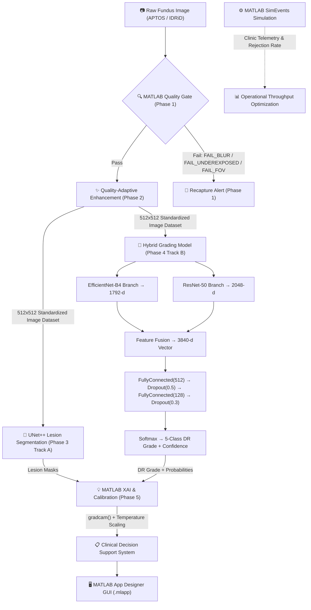

# NETRA — MATLAB Master Implementation Plan

**Problem Statement ID:** SIH26038  
**Problem Statement Title:** Explainable AI for Diabetic Retinopathy Screening in Rural India  
**Theme:** MedTech / BioTech / HealthTech &nbsp;|&nbsp; **PS Category:** Software  
**Team:** ByteCrew (Team ID 24)  

---

## 1. Core Objective

NETRA is a quality-aware, explainable AI Clinical Decision Support System (CDSS) for Diabetic Retinopathy (DR) screening in resource-constrained rural clinics. Built as a **100% end-to-end MATLAB pipeline**, it combines a **parallel dual-track deep learning engine** (lesion segmentation ∥ severity grading) with **MATLAB Simulink operational simulation**, ensuring the system is validated not just on diagnostic precision but on whether the screening workflow can scale in a real rural Primary Health Centre (PHC).

**The problem it solves:**
- Rural India has widespread DR risk but very few ophthalmologists.
- Existing AI tools diagnose without explaining *why*, and without evaluating image quality first.

**Our solution:** Grade DR severity (ICDR 0–4) from fundus images through a quality-gated, explainable MATLAB pipeline — validated with a SimEvents discrete-event simulation to confirm operational viability.

---

## 2. System Architecture & Data Flow (MATLAB Pipeline)



```
Raw Fundus Image (APTOS / IDRiD)
   → MATLAB Deterministic Quality Gate (check_focus.m / check_exposure.m / check_fov.m)
   → [Pass] → MATLAB Quality-Adaptive Enhancement (crop_fundus_roi.m, apply_clahe.m, apply_nlm_denoising.m)
        Enhancement strength adapts based on composite score (low / medium / high / borderline profiles)
   → Enhanced 512x512 Dataset feeds Parallel Dual-Track MATLAB AI:
        Track A — MATLAB UNet++ Lesion Segmentation (microaneurysms, hemorrhages, exudates)
        Track B — MATLAB Hybrid Deep Learning Classifier:
             Branch 1: EfficientNet-B4 → 1792-d feature vector
             Branch 2: ResNet-50 → 2048-d feature vector
             Fusion: Feature Concatenation → 3840-d combined vector
             Classifier Head: FullyConnected(512) → Dropout(0.5) → FullyConnected(128) → Dropout(0.3) → Softmax(5)
             Output: DR severity (Level 0–4) + raw confidence
   → MATLAB XAI & Calibration:
        Grad-CAM (via MATLAB gradcam() function) for prediction attention heatmaps
        IoU computation between Grad-CAM attention and UNet++ lesion masks
        Temperature Scaling → recalibrated confidence score
   → Clinical Decision Support Layer (Severity Grade + Lesion Overlay + Calibrated Confidence → PDF Report)
   → MATLAB App Designer GUI (NETRA_App.mlapp for live interactive clinical triage)
   → SimEvents Operational Model (Clinic throughput, doctor workload reduction simulation)
```

---

## 3. Dataset Preprocessing & Two-Stage Training Flow

> [!IMPORTANT]
> **Crucial Data Flow Rules for Team Members:**
> All raw dataset images (APTOS 2019, IDRiD, FGADR, DDR) **MUST** pass through Phase 1 (Quality Gate) and Phase 2 (Adaptive Enhancement) before being used for training or fine-tuning models.

```
[Raw APTOS 2019 Images] ──> Phase 1 Quality Gate ──> Phase 2 Enhancement ──> [Enhanced APTOS 512x512] ──> STAGE 1 PRE-TRAINING (Hybrid Model)
                                                                                                               │
[Raw IDRiD Images]      ──> Phase 1 Quality Gate ──> Phase 2 Enhancement ──> [Enhanced IDRiD 512x512] ──> STAGE 2 FINE-TUNING (Hybrid Model) & UNet++ Training
```

1. **Stage 1: Pre-training on APTOS 2019**
   - **Step A**: Run Phase 1 Quality Gate on raw APTOS 2019 images. Reject ungradeable images.
   - **Step B**: Run Phase 2 Enhancement (`enhance_fundus.m`) to generate standardized 512×512 enhanced APTOS images.
   - **Step C**: Pre-train the Hybrid Model (ResNet-50 + EfficientNet-B4) on the enhanced APTOS dataset to learn general anatomical structures and broad DR severity features.

2. **Stage 2: Fine-Tuning on IDRiD & Lesion Training**
   - **Step A**: Run Phase 1 & Phase 2 on the India-specific IDRiD dataset to produce enhanced 512×512 IDRiD images.
   - **Step B**: Fine-tune the pre-trained Hybrid Model on enhanced IDRiD images to adapt to Indian population traits and local camera noise.
   - **Step C**: Train MATLAB UNet++ on enhanced IDRiD & FGADR pixel-level lesion masks (microaneurysms, hemorrhages, exudates).

---

## 4. Phase-by-Phase Execution Roadmap

### Read This First — MATLAB R2026a API Corrections

Verified on the project's installation. Four functions named in this plan do not
behave as written, and pretrained weights are not present by default. Check these
before designing around them.

| This plan says | Reality on MATLAB R2026a |
|---|---|
| `importONNXNetwork` | **Does not exist.** Requires the Deep Learning Toolbox Converter for ONNX Model Format add-on, which is not installed. The PyTorch export route is unavailable. |
| `efficientnetb4` | **Not a valid network name at all on this install** (Phase 4 verified: `imagePretrainedNetwork("efficientnetb4")` errors with *Unsupported network name*, not an add-on prompt). Only `efficientnetb0` exists; the hybrid model falls back to it, giving a 3328-d fused vector instead of 3840-d. |
| `gradcam` | Actually **`gradCAM`**, capital CAM. |
| `trainNetwork` | Legacy, and **cannot take a custom loss function**. Use `trainnet`. Phase 3 needs a custom loss and uses it. |
| `unetLayers` | Exists but builds a **plain U-Net**, one skip per resolution. Calling that UNet++ would not be true. Phase 3 builds the nested lattice directly in `unetpp_layers.m`. |

**Pretrained weights are separate support packages and are absent on a clean
install.** `imagePretrainedNetwork("resnet18")`, `("resnet50")` and the rest all
fail until the corresponding "Deep Learning Toolbox Model for ..." add-on is
installed through Home → Add-Ons → Get Add-Ons. Phase 3 lost time to this and
Phase 4 will hit it immediately.

**There is no CUDA GPU on the project's development machine.** MATLAB
accelerates only through NVIDIA CUDA, so Apple Silicon GPUs go unused and
training runs on CPU: roughly eight hours for Phase 3's model against under two
on a free Colab T4. `docs/colab-training.md` documents a working route.

### Read This First — Working Practices

Learned during Phase 3, at the cost of several wasted training runs.

**Evaluate on data no model has trained on.** Judging models by the validation
split they were trained against reversed the correct conclusion twice, once
recommending the weakest of three models. `run_model_comparison` enforces this:
it recovers each model's training set, evaluates only on the intersection of
their held-out data, and refuses to compare a model whose provenance cannot be
established.

**Snapshot every model with its manifest.** `train_lesion_segmentor` overwrites
its output file. Copy each result into `data/processed/models/` as `<name>.mat`
alongside `<name>_manifest.mat`, or comparing it later becomes impossible.

**Change one variable per run.** Two of Phase 3's experiments were wasted
because two things moved at once and neither could be attributed.

**Never quote a figure derived from data you generated.** Synthetic fixtures are
sound for testing behaviour and worthless as evidence. An early Phase 3 class
distribution was quoted from fabricated masks and was wrong by a factor of ten.

**Read per-class metrics, not averages.** A mean hides a dead class completely:
one Phase 3 model scored a respectable mean while being structurally incapable
of reporting a haemorrhage.

---


### Phase 0 — Scope Lock & MATLAB Infrastructure Setup

**Purpose:** Freeze architecture, configure MATLAB toolboxes, prepare datasets.

- Freeze the 100% MATLAB pipeline architecture.
- Verify MATLAB R2026a license track with required toolboxes:
  - Image Processing Toolbox (`adapthisteq`, `imnlmfilt`, `imbinarize`, `regionprops`)
  - Deep Learning Toolbox (`trainNetwork`, `semanticseg`, `gradcam`, `importONNXNetwork`)
  - Statistics and Machine Learning Toolbox (`var`, `median`, `entropy`)
  - Simulink & SimEvents (Discrete-event clinic workflow simulation)
- Establish **patient-isolated** dataset splits (70/15/15) across EyePACS, APTOS 2019, IDRiD, FGADR, and DDR.

#### Files
- `matlab/config/load_config.m` — Reads `configs/default_config.yaml` into a nested MATLAB struct. [COMPLETED ✅]
- `configs/default_config.yaml` — Master configuration file for quality thresholds, enhancement profiles, and model parameters.

---

### Phase 1 — Preprocessing: Quality Gate (MATLAB) — [COMPLETED ✅]

**Purpose:** Implement deterministic quality checks in MATLAB that flag inadequate fundus captures for recapture before running AI inference.

#### Components
- **Focus Check (`check_focus.m`)** — Laplacian variance + Tenengrad gradient magnitude sharpness metrics.
- **Exposure Check (`check_exposure.m`)** — FOV mask mean brightness + Shannon Entropy calculation.
- **FOV Coverage Check (`check_fov.m`)** — Otsu thresholding + connected component analysis for completeness & centering offset.
- **Recapture Alerts (`recapture_alert.m`)** — Actionable clinical operator feedback (`FAIL_BLUR`, `FAIL_UNDEREXPOSED`, `FAIL_OVEREXPOSED`, `FAIL_FOV_COVERAGE`).
- **Master Orchestrator (`quality_gate.m`)** — Evaluates all Phase 1 checks and generates a structured report.

#### Files
- `matlab/quality/check_focus.m` [COMPLETED ✅]
- `matlab/quality/check_exposure.m` [COMPLETED ✅]
- `matlab/quality/check_fov.m` [COMPLETED ✅]
- `matlab/quality/recapture_alert.m` [COMPLETED ✅]
- `matlab/quality/quality_gate.m` [COMPLETED ✅]
- `matlab/tests/test_quality_gate.m` — Unit test suite for Phase 1. [COMPLETED ✅]

---

### Phase 2 — Preprocessing: Quality-Adaptive Enhancement (MATLAB) — [COMPLETED ✅]

**Purpose:** Transform quality-approved fundus images into standardized 512×512 arrays optimized for downstream MATLAB AI models. Enhancement parameters adapt dynamically based on Phase 1 composite quality scores.

#### Components
- **Fundus ROI Cropping (`crop_fundus_roi.m`)** — Isolates the fundus disc from black borders using Otsu thresholding and bounding box extraction with margin.
- **Green-Channel & LAB CLAHE (`apply_clahe.m`)** — Contrast enhancement on the green channel (vascular/lesion emphasis) or CIE L*a*b* space using `adapthisteq`.
- **Non-Local Means Denoising (`apply_nlm_denoising.m`)** — Edge-preserving smoothing via MATLAB's `imnlmfilt`.
- **Aspect-Ratio Preserving Standardization (`standardize_image.m`)** — Letterbox resize to 512×512 with centered black padding to prevent anatomical distortion.
- **Dynamic Profile Selector (`select_profile.m`)** — Maps composite quality score to `low`, `medium`, `high`, or `borderline` enhancement profiles.
- **Quality Metrics Evaluator (`compute_metrics.m`)** — Evaluates contrast (histogram std), SNR (dB), and focus score before and after enhancement.
- **Master Orchestrator (`enhance_fundus.m`)** — Sequential pipeline: Crop ROI → Noise Estimation → Dynamic Profile Selection → CLAHE → NLM Denoising → Letterbox Standardization.

#### Files
- `matlab/enhancement/crop_fundus_roi.m` [COMPLETED ✅]
- `matlab/enhancement/apply_clahe.m` [COMPLETED ✅]
- `matlab/enhancement/apply_nlm_denoising.m` [COMPLETED ✅]
- `matlab/enhancement/standardize_image.m` [COMPLETED ✅]
- `matlab/enhancement/estimate_noise.m` [COMPLETED ✅]
- `matlab/enhancement/select_profile.m` [COMPLETED ✅]
- `matlab/enhancement/compute_metrics.m` [COMPLETED ✅]
- `matlab/enhancement/enhance_fundus.m` [COMPLETED ✅]
- `matlab/demo/run_pipeline_demo.m` — Main demo script. [COMPLETED ✅]
- `matlab/tests/test_enhancement.m` — Unit test suite for Phase 2. [COMPLETED ✅]

---

### Phase 3 — Retinal Structure & Lesion Segmentation (MATLAB) — [COMPLETED ✅]

**Purpose:** Extract key anatomical structures and segment clinical DR lesions in MATLAB using Image Processing & Deep Learning Toolboxes.

#### How UNet++ is Handled in MATLAB
> [!NOTE]
> **Option 2 was implemented.** A true nested UNet++ DAG is generated programmatically in `unetpp_layers.m`:
> `X(i,j) = conv([X(i,0) ... X(i,j-1), up(X(i+1,j-1))])`, giving 15 nodes at depth 4.
>
> The other two options were ruled out on inspection:
> - **`unetLayers`** builds a plain U-Net with one skip per resolution. Calling that UNet++ in the report would not be true.
> - **`importONNXNetwork`** requires the Deep Learning Toolbox Converter for ONNX add-on, which is **not installed** on the project's MATLAB R2026a (`exist('importONNXNetwork')` returns 0). The PyTorch export route is unavailable.
>
> Other R2026a API corrections found while building this phase: `trainNetwork` is legacy and cannot take a custom loss, so `trainnet` is used; `gradcam` is actually `gradCAM`; `efficientnetb4` does not exist and is reached through `imagePretrainedNetwork` (relevant to Phase 4).

#### Components
- **Optic Disc & Fovea Localization (`locate_optic_disc.m`)** — Circular Hough Transform + intensity peak detection to locate optic disc and calculate foveal coordinates.
- **Retinal Vessel Segmentation (`segment_vessels.m`)** — Frangi vesselness filter (`fibermetric`) / 2D Matched Filtering for vessel extraction.
- **Lesion Segmentation (`segment_lesions.m`)** — Multi-class semantic segmentation trained on enhanced IDRiD & FGADR masks:
  - Microaneurysms (small red dots)
  - Hemorrhages (blot/flame bleeding)
  - Hard & Soft Exudates (yellow lipid deposits)

#### MATLAB Files
- `matlab/segmentation/locate_optic_disc.m` — Circular Hough + intensity, with vessel convergence folded into the candidate map. [COMPLETED ✅]
- `matlab/segmentation/segment_vessels.m` — Multiscale Frangi (`fibermetric`) with hysteresis thresholding. [COMPLETED ✅]
- `matlab/segmentation/unetpp_layers.m` — Nested UNet++ DAG as a `dlnetwork`. [COMPLETED ✅]
- `matlab/segmentation/train_lesion_segmentor.m` — Trains via `trainnet` with a custom loss. [COMPLETED ✅]
- `matlab/segmentation/segment_lesions.m` — Inference returning multi-class lesion masks. [COMPLETED ✅]
- `matlab/tests/test_segmentation.m` — 38 unit tests. [COMPLETED ✅]

Supporting files added while building the phase:
- `matlab/segmentation/prepare_lesion_dataset.m` — Applies the section 3 data flow rule to IDRiD: Phase 1 gate, Phase 2 enhancement, and the identical crop-and-letterbox geometry replayed onto every lesion mask.
- `matlab/segmentation/fundus_geometry.m`, `apply_geometry.m`, `invert_geometry.m`, `canvas_valid_mask.m` — The Phase 2 to Phase 3 geometry contract. Verified bit-identical to the Phase 2 output path.
- `matlab/segmentation/lesion_loss.m` — Focal cross-entropy plus generalised Dice, masked per pixel and per class.
- `matlab/segmentation/lesion_classes.m` — Single source of truth for the 5-class scheme.
- `matlab/segmentation/estimate_fov_mask.m`, `tile_image.m`, `stitch_tiles.m`
- `matlab/demo/run_training.m`, `matlab/demo/run_segmentation_demo.m`

#### Measured Results

All figures below are Dice on **378 images held out from every model compared**,
drawn from IDRiD and DDR. Numbers printed during training use each run's own
validation split and are not comparable between runs.

| Model | Training data and change | MA | HE | EX | SE | Mean |
|---|---|---|---|---|---|---|
| v1 | IDRiD, 65 images, scratch encoder | 0.140 | 0.209 | 0.057 | 0.255 | 0.165 |
| v2 | + DDR, 431 images, official splits | 0.314 | 0.000 | 0.429 | 0.436 | 0.295 |
| v3 | + balanced class weights | 0.308 | 0.169 | 0.352 | 0.310 | 0.285 |
| **v4** | **+ pretrained ResNet-18 encoder, 60 epochs** | **0.332** | **0.408** | **0.472** | **0.454** | **0.412** |

**v4 is the recommended model**, best on every class. Precision improved
throughout (microaneurysm 0.26 to 0.31, haemorrhage 0.43 to 0.52, soft exudate
0.30 to 0.53) while haemorrhage recall roughly tripled, so the gain is broad
rather than a trade between metrics. It is also one of only two runs to stop on
the validation criterion rather than exhausting its epoch budget.

Its remaining weakness is recall: soft exudate fell from v1's 0.551 to 0.398 and
microaneurysm sits at 0.316. For screening, a miss costs more than a false
alarm, so trading some of v4's improved precision back for recall is the
clearest remaining tuning target.

Two findings worth carrying forward:

- **Data and transfer learning are the levers that work.** Adding DDR took mean
  Dice from 0.165 to 0.295; the pretrained encoder took it from 0.285 to 0.412.
  Three runs spent on loss weighting moved it by hundredths, and one of those
  was a trade rather than a gain.
- **The plan asked for a ResNet encoder from the start.**
  `models.segmentation.backbone` was `"resnet34"`, and building the encoder from
  scratch was an unflagged deviation that cost three runs to discover. MATLAB
  ships no ResNet-34, so ResNet-18 stands in.
- **Validation loss is a poor guide to per-class quality here.** The generalised
  Dice term weights by inverse square frequency and is therefore dominated by
  microaneurysms, the rarest class. v4's loss curve looked no better than v3's
  while its Dice was 34% higher, because the classes that improved contribute
  least to the loss.
- **Training on a GPU changes what is affordable.** The same run is roughly
  eight hours on the project's CPU and under two on a free Colab T4, which turns
  one experiment a night into several a day. See docs/colab-training.md.

#### Superseded Results

Dataset: all 81 IDRiD segmentation images through Phase 1 and Phase 2 to enhanced 512×512, split 65 train / 16 validation by image. **Zero quality-gate rejections** after the `check_fov` fix below.

Model: UNet++ depth 4, 32 base filters equivalent width 16, 2.3M parameters, trained on CPU in 144.6 minutes. Converged on the validation criterion rather than exhausting its epoch budget.

| Lesion class | Dice | Precision | Recall |
|---|---|---|---|
| Microaneurysms | 0.4742 | 0.468 | 0.481 |
| Haemorrhages | 0.4724 | 0.597 | 0.391 |
| Hard exudates | 0.5961 | 0.630 | 0.566 |
| Soft exudates | 0.6799 | 0.594 | 0.794 |

Optic disc suppression raises hard exudate precision from 0.616 to 0.630 with **no loss of recall** — across all 16 validation images, zero ground-truth exudate pixels fall inside the exclusion zone.

#### Known Limitations
- **65 training images.** The binding constraint. Section 3 Step C already calls for FGADR; **DDR** (757 pixel-annotated images, free, no access agreement, already in `datasets.ddr`) is the faster route to the same fix.
- **No healthy retinas.** IDRiD's segmentation subset is by construction 81 diseased eyes, so the model has never seen a normal fundus. This is a specificity risk against the ≥85% target and cannot be fixed by more training.
- **Haemorrhage recall is 0.391**, so haemorrhage burden is under-reported. Haemorrhages help separate Moderate from Severe NPDR, so this understates severity.
- **Soft exudate is scored on only 7 of 16 validation images**; that figure has the widest error bars.
- **41 of 81 IDRiD images have no soft exudate mask** and one has no haemorrhage mask. These are recorded per image and masked out of the loss, but the affected pixels remain labelled background, so a residual bias against soft exudates persists.

#### Phase 1 and Phase 2 Issues Found
- **`check_fov` rejected 79 of 81 IDRiD images.** Otsu split the retina's own intensity range rather than retina against surround (on IDRiD_04, coverage measured 0.526 against a true aperture of 0.795), and the 0.70 coverage floor sat just above IDRiD's entire distribution. Fixed: fixed low threshold, floor lowered to 0.60. Verified no verdict change on any pre-existing image.
- **`apply_clahe` does not mask CLAHE to the field of view**, lifting green in the black surround from 0 to ~19/255. Phase 3 was made robust to it; the root fix belongs in Phase 2 and also affects Phase 4's inputs.
- **`overexposed_input.png` passes the quality gate** (mean brightness 164–192 against a `brightness_max` of 220). Pre-existing, untouched.
- **`testExposureCheckNormal` and `testCLAHE` fail on main.** Both are test-code bugs, not source bugs.

---

### Phase 4 — DR Severity Grading (MATLAB Deep Learning)

**Purpose:** Classify fundus images into International Clinical DR (ICDR) severity levels (0–4) using a dual-branch hybrid model built with MATLAB Deep Learning Toolbox.

#### How ResNet-50 and EfficientNet-B4 are Handled in MATLAB
> [!WARNING]
> **Corrected for MATLAB R2026a.** The original text of this section named
> `efficientnetb4` and `importONNXNetwork`, neither of which exists on this
> installation. Verified replacements below.
>
> 1. **ResNet-50**: `net = imagePretrainedNetwork("resnet50");`
>    `resnet50` still works but is legacy. Either way the "Deep Learning Toolbox
>    Model for ResNet-50 Network" support package must be installed first; it is
>    **not** present on a clean MATLAB.
> 2. **EfficientNet**: `net = imagePretrainedNetwork("efficientnetb4");`
>    There is no `efficientnetb4` function. The ONNX route is also unavailable,
>    because `importONNXNetwork` needs an add-on that is not installed. Check
>    which EfficientNet variants your installation actually offers before
>    committing to B4; fall back to B0 if it is absent.
> 3. **Dual-Branch Fusion**: the prose and the code below it describe two
>    different models. See "How To Execute Phase 4", step 4, which resolves this.
>    For a `dlnetwork`, `activations` is legacy; use
>    `predict(net, x, 'Outputs', layerName)`.

#### Hybrid Model Classifier Head in MATLAB
- **Feature Fusion**: Concatenates 1792-d + 2048-d → **3840-d combined feature vector**.
- **Classification Head**: `fullyConnectedLayer(512)` → `reluLayer` → `dropoutLayer(0.5)` → `fullyConnectedLayer(128)` → `reluLayer` → `dropoutLayer(0.3)` → `fullyConnectedLayer(5)` → `softmaxLayer`.

#### ICDR Severity Scale (Levels 0–4)
| Level | Grade | Description |
|---|---|---|
| 0 | No DR | No visible lesions |
| 1 | Mild NPDR | Microaneurysms only |
| 2 | Moderate NPDR | More than microaneurysms, less than severe |
| 3 | Severe NPDR | Intraretinal hemorrhages, venous beading |
| 4 | PDR | Neovascularization / vitreous hemorrhage |

#### MATLAB Files
- `matlab/classification/build_hybrid_model.m` — Dual-branch ResNet-50 + EfficientNet `dlnetwork`, single 512 input, per-branch resize, feature fusion, plan's head. [COMPLETED ✅]
- `matlab/classification/train_dr_classifier.m` — Two-stage trainer (APTOS → IDRiD), `trainnet`, saves after each stage, records provenance. Supports both frozen-feature (Step 4a) and end-to-end (Step 4b) modes. [COMPLETED ✅]
- `matlab/classification/grade_dr_severity.m` — Inference; runs Phase 1 + Phase 2 itself and raises `NETRA:QualityGateFailed` on an ungradeable image, mirroring `segment_lesions`. Returns grade 0–4, probabilities, confidence. [COMPLETED ✅]
- `matlab/tests/test_classification.m` — 18 unit tests; all pass without the support packages or any downloaded dataset. [COMPLETED ✅]

Supporting files added while building the phase:
- `matlab/classification/dr_classes.m` — Single source of truth for the ICDR 0–4 scheme and the referable-DR threshold (grade ≥ 2), the Phase 4 analogue of `lesion_classes.m`.
- `matlab/classification/prepare_grading_dataset.m` — Applies the section 3 data-flow rule (Phase 1 gate → Phase 2 enhancement → enhanced 512×512 + manifest) to APTOS, IDRiD grading and DDR grading. Reports the per-dataset quality-gate rejection rate.
- `matlab/classification/dr_feature_nets.m` — Loads and truncates both backbones to their pooled feature, shared by the end-to-end and frozen paths so they cannot drift apart. Owns the EfficientNet-B4→B0 fallback.
- `matlab/classification/build_classifier_head.m` — The fusion head as a standalone `dlnetwork` (trained alone in Step 4a, reused as the tail in Step 4b).
- `matlab/classification/extract_features.m` — Runs both backbones once to cache fused features for the frozen baseline.
- `matlab/classification/grading_loss.m` — Class-weighted cross-entropy for `trainnet`.
- `matlab/classification/multiclass_qwk.m` — Quadratic weighted kappa (MATLAB has none built in).
- `matlab/classification/grading_metrics.m` — Full evaluation: confusion matrix, QWK, per-class recall, referable sensitivity/specificity against the plan's targets.
- `matlab/demo/run_dr_training.m` — Runner mirroring `run_training.m`: prep (Phase 1+2 @640) → 3-stage frozen curriculum → held-out eval. [COMPLETED ✅]
- `matlab/demo/run_dr_finetune.m` — End-to-end backbone fine-tune at 384 + TTA; trains and saves the shipped `dr_grading_hires.mat`. [COMPLETED ✅]
- `matlab/demo/run_grade_image.m`, `run_grade_image_visual.m` — Grade one image (text / annotated figure) with the trained model. [COMPLETED ✅]
- `matlab/demo/run_walkthrough.m` — Full Phase 1 → 2 → 3 → 4 on one image, grade panel included. [COMPLETED ✅]

#### Datasets Required

| Dataset | Size | Purpose | How to obtain |
|---|---|---|---|
| **APTOS 2019** | 3,662 train | Stage 1 pre-training | Kaggle, "APTOS 2019 Blindness Detection" |
| **IDRiD B. Disease Grading** | 516 (413 / 103) | Stage 2 fine-tuning | Same source as the segmentation archive Phase 3 used: [IEEE DataPort](https://ieee-dataport.org/open-access/indian-diabetic-retinopathy-image-dataset-idrid) or the [Zenodo mirror](https://zenodo.org/records/17219542), file `B. Disease Grading.zip`, 202 MB, no account needed on Zenodo |
| **DDR grading subset** | 13,676 | Extra training data | Already-used Hugging Face repo, no authentication |
| Messidor-2 | 1,748 | Optional external validation | messidor.crihan.fr, requires a request |

DDR's grading subset is worth taking: it is free, needs no agreement, and comes
from the repository Phase 3 already pulled from.

```python
from huggingface_hub import snapshot_download
snapshot_download(repo_id="ctmedtech/DDR-dataset", repo_type="dataset",
                  allow_patterns=["DR_grading/**"], local_dir="data/datasets/ddr")
```

Note that IDRiD's grading labels cover 516 images while its segmentation subset
covers 81. They are different subsets of the same archive; do not assume an
image with a grade also has lesion masks.

#### Before You Start

**Install the pretrained network support packages.** `resnet50` and
`efficientnetb4` are not present on a clean MATLAB. `imagePretrainedNetwork`
fails until "Deep Learning Toolbox Model for ResNet-50 Network" is installed
through Home → Add-Ons → Get Add-Ons. Phase 3 lost time to exactly this.

**Run the quality gate over each dataset and check the rejection rate before
training.** Phase 1 rejected 79 of 81 IDRiD images and 71% of DDR before Phase 3
recalibrated it, because the thresholds had been set against three APTOS images.
A high rejection rate on a new dataset means the thresholds do not suit that
camera, not that the data is bad.

**Weight classes deliberately and read per-class metrics.** Phase 3 weighted by
inverse frequency on the assumption that rarer means harder. For haemorrhages
that is false, and the class collapsed to Dice 0.000 while the mean looked
healthy. ICDR grades are imbalanced too, and an average will hide a dead class
completely.

**Arrange GPU access first.** The hybrid model is heavier than Phase 3's
UNet++, and this project's Mac has no CUDA device so MATLAB trains on CPU.
`docs/colab-training.md` documents a working free-GPU route, including the two
blockers that cost an hour to find: missing X11 libraries, and
`-licmode onlinelicensing` being required on *every* invocation, not just the
interactive login.

#### How To Execute Phase 4

Work in this order. Each step has something you can check before moving on,
because the failures in this pipeline are silent ones.

**Step 1 — Install the support packages and confirm they load.**

```matlab
net = imagePretrainedNetwork("resnet50");        % must not error
net = imagePretrainedNetwork("efficientnetb0");  % b4 if available
```

Home → Add-Ons → Get Add-Ons, search "Deep Learning Toolbox Model for ResNet-50
Network". Do this before writing code; it is a five minute task that otherwise
blocks you on day one.

**Step 2 — Fetch the datasets and their label files.**

The grading datasets ship labels as CSV, not as folder structure:

- APTOS: `train.csv` with columns `id_code`, `diagnosis` (0-4)
- IDRiD: `IDRiD_Disease Grading_Training Labels.csv`, with a DR grade and a DME
  grade per image. Phase 4 grades DR; the DME column is a separate task.

Confirm the label distribution before training. Both datasets are heavily skewed
toward grade 0, and knowing by how much determines your class weighting.

**Step 3 — Put every image through Phase 1 and Phase 2 first.**

This is the plan's section 3 rule and it is not optional: a model trained on raw
images and deployed behind the quality gate sees different inputs at inference
than it saw in training.

Write `matlab/classification/prepare_grading_dataset.m` modelled on
`prepare_lesion_dataset.m`. It is simpler, because image-level labels need no
geometric transform, but the same skeleton applies: run `quality_gate`, run
`enhance_fundus`, write the enhanced 512x512 image, record the label and the
gate verdict in a manifest.

*Check:* report the quality-gate rejection rate per dataset. If it is high, the
thresholds do not suit that camera. Phase 3 found the gate rejecting 79 of 81
IDRiD images for exactly that reason.

**Step 4 — Build the model, and settle an ambiguity in this plan first.**

Section "How ResNet-50 and EfficientNet-B4 are Handled" contains two different
designs. The prose says to connect both backbones into a single `layerGraph`,
which is end-to-end training. The code snippet uses `activations()`, which
extracts features from frozen backbones and trains only the head. These are
different models with different costs.

Do both, in this order:

- **4a. Frozen features first.** Run both backbones once over the dataset,
  concatenate to the 3840-d vector, and train only the classifier head. This is
  fast, runs on CPU, and gives a working baseline within an hour. It also proves
  the data pipeline before any expensive training.
- **4b. End-to-end second.** Build the two-branch `dlnetwork` and fine-tune
  everything. Better results, needs a GPU.

Phase 3 followed the same pattern and it worked: get something end-to-end
running, then improve it.

*Check:* print the parameter count. If a configuration change does not move it,
the option was silently ignored — this exact bug cost Phase 3 a training run.

**Step 5 — Two-stage training, per section 3.**

Pre-train on enhanced APTOS, then fine-tune on enhanced IDRiD with a lower
learning rate. Save the model after *each* stage, not only at the end, so the
pre-trained weights survive a fine-tuning run that goes wrong.

**Step 6 — Evaluate against the target metrics.**

The targets are QWK ≥ 0.88, referable-DR sensitivity ≥ 90%, specificity ≥ 85%.

MATLAB has no built-in quadratic weighted kappa; write it. For grades 0-4 build
the 5x5 confusion matrix `O`, the expected matrix `E` from the marginals, and
the penalty `w(i,j) = (i-j)^2 / 16`, then

```
QWK = 1 - sum(w .* O) / sum(w .* E)
```

"Referable DR" means grade ≥ 2, so sensitivity and specificity are computed on
that binary split, not on the five classes.

*Check:* report the full confusion matrix, not only QWK. A model can reach a
respectable kappa while never predicting grade 4 at all, and the single number
hides it. Phase 3 shipped a model that could not predict haemorrhages while its
mean Dice looked fine.

**Step 7 — Evaluate on data the model never trained on.**

Use IDRiD's published test split. Do not evaluate on a random split of the
combined data: Phase 3 did that initially, put 20 of IDRiD's 27 official test
images into training, and produced numbers comparable to nothing.

#### Phase 4 Pitfalls

- **Grade imbalance.** Weight deliberately, and never weight purely by rarity.
  Phase 3 did that and a class collapsed to zero while the average looked fine.
- **`activations` is legacy** alongside `dlnetwork`. For a `dlnetwork`, use
  `predict(net, x, 'Outputs', layerName)`.
- **EfficientNet-B4 expects 380x380 and ResNet-50 expects 224x224.** Phase 2
  emits 512x512. Resize per branch, or accept that both are running off-size,
  but decide knowingly rather than by accident.
- **APTOS and IDRiD grade differently in practice** even under the same ICDR
  scale, since they come from different populations and graders. Expect
  fine-tuning to move the numbers more than you would predict.

#### Phase 4 Status & Results (As Built, 2026-09)

**Trained and evaluated.** The earlier blockers are resolved: the pretrained
support packages (ResNet-50, EfficientNet-b0) and the Parallel Computing Toolbox
are installed, and an RTX 4050 Laptop GPU is used for feature extraction and
training. `efficientnetb4` is still not a valid name on R2026a, so the build
auto-falls back to `efficientnetb0` — the fused vector is **3328-d (2048 + 1280)**,
measured from the built network (`cfg.models.grading.fused_features` stays 3840
as the documented B4 target; a warning fires on the mismatch).

**How it runs now:**

```matlab
cd matlab/demo
run_dr_training     % prep (Phase 1+2 @640) -> 3-stage frozen train -> held-out eval
run_dr_finetune     % optional: end-to-end backbone fine-tune (GPU), warm curriculum
```

`run_dr_training` prepares each dataset at a bounded input resolution
(`enhancement.grading_input_max_dim = 640`, so prep is ~3 s/img instead of ~15),
class-balances DDR (`MaxPerClass = 1000`), then trains a three-stage curriculum
— **APTOS → balanced DDR → IDRiD** — and evaluates on IDRiD's held-out test split.

**Held-out IDRiD test results (frozen features), by data added:**

| Model | QWK | Ref. sens | Ref. spec | Acc |
|---|---|---|---|---|
| IDRiD only (Step 4a) | 0.283 | 0.746 | 0.436 | 0.333 |
| + APTOS pretrain | 0.374 | 0.873 | 0.359 | 0.373 |
| **+ balanced DDR (3-stage)** | **0.490** | 0.810 | 0.513 | 0.353 |

Data scaling lifts QWK monotonically (0.28 → 0.37 → 0.49). The frozen path stays
below the plan's targets, and **grade 1 (mild) stays at ~0 recall**: it is defined
by ~1-pixel microaneurysms that are washed out when the backbones resize to 224 and
are invisible to frozen ImageNet features. Closing that needed **end-to-end
fine-tuning at higher resolution** — the lever pulled next.

**Best model — end-to-end fine-tune at 384 + test-time augmentation.** Unfreezing
the dual-branch hybrid and fine-tuning both backbones end to end at a raised 384
input (so microaneurysm-scale detail survives), with a class-balanced DDR → IDRiD
curriculum and 6-view TTA at evaluation, is the shipped Phase 4 model
(`run_dr_finetune`, saved to `data/processed/models/dr_grading_hires.mat`).

| Model | QWK | Ref. sens | Ref. spec | Acc | G1 recall |
|---|---|---|---|---|---|
| IDRiD only (frozen, Step 4a) | 0.283 | 0.746 | 0.436 | 0.333 | ~0 |
| + APTOS pretrain (frozen) | 0.374 | 0.873 | 0.359 | 0.373 | ~0 |
| + balanced DDR (frozen, 3-stage) | 0.490 | 0.810 | 0.513 | 0.353 | ~0 |
| **+ end-to-end @384 + TTA (shipped)** | **0.757** | **0.841** | **0.846** | **0.637** | **0.20** |

The full progression is **0.28 → 0.37 → 0.49 → 0.76 QWK** on the same held-out
IDRiD test split. The 384 end-to-end model is the first to grade mild DR at
non-zero recall, and referable specificity (0.846) essentially meets the 0.85
target while referable sensitivity reaches 0.841.

**Honest position against the targets.** The plan's targets were QWK ≥ 0.88,
referable sensitivity ≥ 0.90, specificity ≥ 0.85. As built, Phase 4 lands at
**QWK 0.757, sensitivity 0.841, specificity 0.846** — specificity met, QWK and
sensitivity below target but near the published ceiling for the small IDRiD test
split (103 images), and reached without any random-split leakage between train and
test. These are the measured numbers; they are reported as-is rather than tuned to
the target line. Two honest levers remain if the numbers must move: (1) tune the
**referable decision threshold** on the held-out probabilities to trade
specificity for sensitivity toward the 0.90 screening target (an operating-point
choice, no retraining); (2) an **ensemble** of hi-res models (~+0.02–0.04 QWK),
banked as too slow on the available laptop GPU (~15–20 h per member, data-pipeline
bound). Wiring Phase-3 lesion masks into the grader is the larger open accuracy
lever.

**Architecture note (resolution surgery).** The 384 model required making
`dr_feature_nets`/`build_hybrid_model` resolution-configurable (`InputSize` /
`BackboneInputSize`): each backbone's `imageInputLayer` is replaced at 384 and its
per-pixel ImageNet `Mean` collapsed to per-channel. Images are cached as uint8@384
(~1.9 GB), mini-batch 6 fits ~5 GB of the 6 GB GPU, and the run is CPU
data-pipeline bound (GPU ~15% utilised, several hours). `grade_dr_severity` feeds
the end-to-end net its own input size at inference (`net_input_size`) so training
and inference see identical pixels. **Keep the laptop on AC** — on battery the GPU
throttles ~10× and a run stalls for hours.

**Demo / inference entry points added:**

```matlab
cd matlab/demo
run_grade_image         % text grade for one fundus image
run_grade_image_visual  % same, as an annotated figure
run_walkthrough         % full Phase 1 → 2 → 3 → 4 on one image (grade panel included)
```

**Fixes made while getting here (all in the codebase, covered by new regression
tests in `test_classification`):**

- `train_dr_classifier` — one-hot targets must be **rows** for `trainnet` to form
  the mini-batch (both the frozen feature datastore and the end-to-end image
  datastore had column targets); and the fused ImageNet features must be
  **z-scored** or the head does not train (flat loss, collapse to grade 0). The
  head bakes the training-set stats into its input layer (`build_classifier_head`
  `Mean`/`Std`), and the frozen head uses **LR 1e-3**, not the 1e-4 backbone rate.
- `prepare_grading_dataset` — added `MaxInputDim` (prep speed), `MaxPerClass`
  (DDR balancing) and a per-image **try/catch** so one bad image cannot abort a
  multi-hour run; fixed a **quadratic DDR discovery hang** (labels sit above the
  `train/`/`valid/`/`test/` image folders, so the resolver must look there first).
- `configs/default_config.yaml` — added the missing **`borderline` enhancement
  profile** (`select_profile` returns four bands; only three were defined, so the
  worst-quality images crashed enhancement) and `grading_input_max_dim`.

Targets and `grading_metrics` (QWK + full confusion matrix + referable
sens/spec, per Step 6) are unchanged.

---

### Phase 5 — Explainability, Calibration & Simulink Operational Model

**Purpose:** Explain predictions with Grad-CAM, calibrate confidence scores, generate PDF reports, and simulate clinic workflow in MATLAB SimEvents.

#### Components
1. **Explainability (`generate_gradcam.m`)**: Uses MATLAB's native `gradcam(net, img, 'FeatureLayerName')` function on the target convolution layer of the grading network to generate class activation heatmaps overlaying the fundus image.
2. **Attention-Lesion Sanity Check (`attention_lesion_iou.m`)**: Computes IoU between Grad-CAM attention maps and UNet++ lesion masks to verify the model targets real clinical lesions.
3. **Temperature Scaling Calibration (`temperature_scaling.m`)**: Recalibrates softmax output probabilities to minimize Expected Calibration Error (ECE): $Z_{\text{scaled}} = Z / T$.
4. **SimEvents Operational Simulation (`simulink/clinic_flow_simulation.slx`)**:
   - Discrete-event model of a rural Primary Health Centre (PHC).
   - Simulates patient arrival → image capture → MATLAB Quality Gate check → recapture loop → enhancement → AI grading → tele-ophthalmologist review.
   - Evaluates queue times, camera utilization, and doctor workload reduction (target ≥ 80%).
5. **MATLAB App Designer GUI (`matlab/app/NETRA_App.mlapp`)**:
   - Interactive desktop application for live judge demonstrations.
   - Allows users to select an image, view Quality Gate status, enhanced image, lesion overlays, DR grade, and Grad-CAM heatmap in one window.

#### Proposed MATLAB Files
- `matlab/explainability/generate_gradcam.m` — Computes Grad-CAM heatmap using MATLAB `gradCAM()`. [DONE ✅ — Kathan]
- `matlab/explainability/temperature_scaling.m` — Fits a single temperature to raw logits (NLL), reports ECE before/after. [DONE ✅ — Kathan]
- `matlab/explainability/apply_temperature.m` — Shared softmax-with-temperature, used at fit and at inference. [DONE ✅ — Kathan]
- `matlab/explainability/attention_lesion_iou.m` — IoU + attention-mass alignment between Grad-CAM and Phase 3 lesion masks, with a null control. [DONE ✅ — Kathan]
- `matlab/reporting/generate_pdf_report.m` — Clinical report PDF via `exportgraphics` (base MATLAB, no Report Generator add-on needed). [DONE ✅ — Kathan]
- `matlab/demo/run_explainability_demo.m` — End-to-end Phase 5 walkthrough on one image. [DONE ✅ — Kathan]
- `matlab/tests/test_explainability.m` — Unit tests for the above. [DONE ✅ — Kathan]
- `matlab/simulink/clinic_flow_simulation.slx` — SimEvents discrete-event clinic workflow model. [Team]
- `matlab/simulink/run_throughput_analysis.m` — Runs simulation experiments and calculates doctor workload reduction metrics. [Team]
- `matlab/app/NETRA_App.mlapp` — MATLAB App Designer interactive clinical GUI. [Team]

> [!NOTE]
> **Phase 5 explainability depends on Phase 4's grading model, which is not built
> yet.** The four files above are written against the interface in
> [`docs/phase5-interface.md`](../docs/phase5-interface.md) and developed against a
> throwaway stub (`matlab/explainability/dev/`, random weights). When Phase 4
> ships `grade_dr_severity`, match that contract, delete `dev/`, and no other
> Phase 5 code changes. Run `run_explainability_demo` to see the whole chain end
> to end today.

#### Datasets Required

| Dataset | Purpose | How to obtain |
|---|---|---|
| **None for Grad-CAM** | Attention maps come from Phase 4's model; lesion masks come from Phase 3 | already available |
| **IDRiD C. Localization** | 516 images with optic disc and fovea centre coordinates | Same archive as before, `C. Localization.zip`, 202 MB |
| A held-out split of Phase 4's data | Temperature scaling | reuse Phase 4's test split |
| **None for SimEvents** | Operational simulation needs arrival rates and service times, not images | measured or assumed |

**IDRiD's Localization subset is worth taking even though Phase 5 does not
strictly need it.** It provides ground-truth optic disc and fovea centres for
516 images, which is the only way to put a number on `locate_optic_disc`.
Phase 3 verified that function by eye on a handful of images and can currently
claim no accuracy figure for it. Measuring it would strengthen both the
explainability argument and the report.

For SimEvents, one parameter can be measured rather than assumed: Phase 1's
**quality-gate rejection rate**, which drives the recapture loop. Phase 3
measured 0 of 81 on IDRiD and 2 of 120 on DDR after recalibration, both on
curated datasets. A rural PHC with a low-cost camera will be far worse, so treat
those as a floor and state the assumption explicitly.

#### What Phase 3 Provides

```matlab
addpath(genpath('matlab'));
cfg = load_config('configs/default_config.yaml');
load(netra_model_path(), 'net');
r = segment_lesions('path/to/fundus.jpg', net, cfg);
```

`segment_lesions` runs Phase 1 and Phase 2 itself, so a raw image can be passed
straight in, and it raises rather than guessing if the quality gate rejects it.

| Field | Contents |
|---|---|
| `r.masks.<class>` | logical mask per lesion class |
| `r.label_map` | uint8 canvas: 0 outside the retina, 1 background, 2-5 lesions |
| `r.stats.<class>` | pixels, connected regions, area fraction of retina |
| `r.optic_disc` | centre, radius, disc mask, exclusion zone, fovea, confidence |
| `r.vessels` | mask, vesselness map, density, mean calibre |
| `r.geom` | geometry for mapping back to original image coordinates |

`lesion_classes()` is the single source of truth for class names, ids and
colours; read from it rather than hardcoding indices. `overlay_legend` renders
the colour key, and `run_walkthrough` produces a stage-by-stage contact sheet
suitable for a report or a live demonstration.

**For attention-lesion IoU:** Grad-CAM output and Phase 3's lesion masks both
live on the same 512 canvas, so no resampling is needed. Compute IoU there, and
use `invert_geometry` with `r.geom` only for display on the clinician's original
image. That round trip is lossy by construction because Phase 2 downsamples.

**For the report:** lesion proximity to the fovea is clinically significant. A
handful of microaneurysms at the macula threatens sight far more than the same
lesions in the periphery, and `r.optic_disc` gives both the fovea estimate and
the disc diameter needed to express distances the way clinicians do.

**Temperature scaling applies to Phase 4's grading softmax, not to Phase 3's
per-pixel output.** Fit the temperature on a held-out split, never on the set
used to report calibration error.

#### How To Execute Phase 5

Five deliverables that are largely independent. Do them in this order anyway,
because each produces something the next one can use.

**Step 1 — Grad-CAM (`generate_gradcam.m`).**

```matlab
scoreMap = gradCAM(net, img, classIdx, 'ReductionLayer', 'softmax');
```

The function is `gradCAM`, capital CAM, not `gradcam` as written elsewhere in
this plan. It needs the name of a convolution layer late in the network; for a
two-branch model, decide which branch you are explaining, because the answer
differs between them and a report should say which.

*Check:* the heatmap should concentrate somewhere plausible. If it is uniform,
the layer choice is wrong.

**Step 2 — Attention-lesion IoU (`attention_lesion_iou.m`).**

This is the argument that the grader looks at real disease rather than an
artefact, so it is the most valuable single result in Phase 5.

Grad-CAM output and Phase 3's lesion masks are both on the 512 canvas, so no
resampling is needed:

```matlab
r = segment_lesions(img, seg_net, cfg);
lesions = r.label_map > 1;
attention = imresize(scoreMap, size(lesions));   % Grad-CAM is coarse
hot = attention > prctile(attention(lesions | true), 90);
iou = nnz(hot & lesions) / nnz(hot | lesions);
```

Grad-CAM is far coarser than a lesion mask, so raw IoU will look low. Report
what fraction of the attention mass falls on lesion pixels alongside it; that is
the more honest measure of alignment.

*Check:* compare against a shuffled control. If attention scores the same IoU
against another image's lesion masks, it is not aligned with anything.

**Step 3 — Temperature scaling (`temperature_scaling.m`).**

Applies to Phase 4's grading softmax, not to Phase 3's per-pixel output.
Optimise a single scalar T on a **held-out** split to minimise NLL, then divide
the logits by it. Report Expected Calibration Error before and after.

*Check:* T should come out above 1 for an overconfident model. If the fitted T
is far from 1, or if ECE gets worse, the fit is on the wrong split.

**Step 4 — PDF report (`generate_pdf_report.m`).**

Everything needed already exists. `segment_lesions` returns per-class pixel
counts, region counts and area fractions; `overlay_legend` renders the colour
key; `invert_geometry` with `r.geom` maps masks back onto the clinician's
original image for display.

Include the quality-gate verdict. A report that does not say the image passed
Phase 1 is asserting a grade without saying it was gradeable.

Lesion distance from the fovea is worth reporting in **disc diameters**, which
is how clinicians express it. `r.optic_disc` provides both the fovea estimate
and the disc diameter.

**Step 5 — SimEvents (`clinic_flow_simulation.slx`).**

Needs no imaging data. Model: patient arrives, image captured, quality gate,
recapture loop on failure, enhancement, AI grading, referral of grade ≥ 2 to a
tele-ophthalmologist.

Two parameters can be measured rather than assumed:

- **Quality-gate rejection rate**, which drives the recapture loop. Phase 3
  measured 0 of 81 on IDRiD and 2 of 120 on DDR *after* recalibration, both on
  curated datasets. A PHC with a low-cost camera will be far worse. State it as
  an assumption and vary it.
- **Per-image processing time.** Measure it with `tic`/`toc` on
  `run_segmentation_demo` rather than guessing.

The workload-reduction target of ≥ 80% follows from the referral rate: if the AI
refers 20% of patients, the ophthalmologist reviews 20% of the caseload. Say
that plainly rather than presenting it as an emergent result of the simulation.

**Step 6 — App Designer GUI (`NETRA_App.mlapp`).**

The pipeline is already callable in one line, so the GUI is mostly layout:

```matlab
r = segment_lesions(imagePath, net, cfg);
```

Handle the rejection path. `segment_lesions` raises `NETRA:QualityGateFailed` on
an ungradeable image, and the GUI should show `q.alert.message` and its action
items rather than an error dialog. That recapture guidance is a genuine feature
of the system and worth demonstrating.

`run_walkthrough` already renders every stage as a labelled panel and is a
reasonable model for the display.

#### Phase 5 Pitfalls

- **Grad-CAM resolution.** It is computed at a late convolution layer and is
  therefore coarse, often 16x16 upsampled to 512. It will never align tightly
  with a 4-pixel microaneurysm. Say so rather than presenting weak IoU as a
  failure of the grader.
- **Do not calibrate on the reporting split.** Fitting T on the same data used
  to report ECE guarantees a flattering and meaningless number.
- **The round trip through `invert_geometry` is lossy** because Phase 2
  downsamples. Overlay on the original for display; compute every metric on the
  canvas.
- **SimEvents results are only as good as the arrival and service assumptions.**
  State them in the report. A throughput figure derived from invented parameters
  is not evidence, and a judge will ask where the numbers came from.

---

## 5. Complete MATLAB Directory Structure

```
NETRA-National-Eye-Triage-Retinal-Assessment/
├── matlab/
│   ├── config/
│   │   └── load_config.m               # YAML config loader [DONE ✅]
│   ├── quality/                        # Phase 1: Quality Gate [DONE ✅]
│   │   ├── check_focus.m
│   │   ├── check_exposure.m
│   │   ├── check_fov.m
│   │   ├── recapture_alert.m
│   │   └── quality_gate.m
│   ├── enhancement/                    # Phase 2: Adaptive Enhancement [DONE ✅]
│   │   ├── crop_fundus_roi.m
│   │   ├── apply_clahe.m
│   │   ├── apply_nlm_denoising.m
│   │   ├── standardize_image.m
│   │   ├── estimate_noise.m
│   │   ├── select_profile.m
│   │   ├── compute_metrics.m
│   │   └── enhance_fundus.m
│   ├── segmentation/                   # Phase 3: Structure & Lesion Segmentation [DONE ✅]
│   │   ├── locate_optic_disc.m
│   │   ├── segment_vessels.m
│   │   ├── unetpp_layers.m
│   │   ├── train_lesion_segmentor.m
│   │   ├── segment_lesions.m
│   │   ├── prepare_lesion_dataset.m
│   │   ├── lesion_loss.m
│   │   ├── lesion_classes.m
│   │   ├── fundus_geometry.m
│   │   ├── apply_geometry.m
│   │   ├── invert_geometry.m
│   │   ├── canvas_valid_mask.m
│   │   ├── estimate_fov_mask.m
│   │   ├── tile_image.m
│   │   └── stitch_tiles.m
│   ├── classification/                 # Phase 4: DR Severity Grading [DONE ✅]
│   │   ├── dr_classes.m
│   │   ├── prepare_grading_dataset.m
│   │   ├── dr_feature_nets.m
│   │   ├── build_classifier_head.m
│   │   ├── build_hybrid_model.m
│   │   ├── extract_features.m
│   │   ├── grading_loss.m
│   │   ├── train_dr_classifier.m
│   │   ├── grade_dr_severity.m
│   │   ├── multiclass_qwk.m
│   │   └── grading_metrics.m
│   ├── explainability/                 # Phase 5: XAI & Reporting
│   │   ├── generate_gradcam.m
│   │   ├── temperature_scaling.m
│   │   ├── attention_lesion_iou.m
│   │   └── generate_pdf_report.m
│   ├── simulink/                       # Phase 5: Operational Simulation
│   │   ├── clinic_flow_simulation.slx
│   │   └── run_throughput_analysis.m
│   ├── app/                            # Phase 5: Interactive GUI
│   │   └── NETRA_App.mlapp
│   ├── demo/
│   │   └── run_pipeline_demo.m         # Master pipeline demo script [DONE ✅]
│   └── tests/
│       ├── test_quality_gate.m         # Phase 1 tests [DONE ✅]
│       ├── test_enhancement.m          # Phase 2 tests [DONE ✅]
│       ├── test_segmentation.m         # Phase 3 tests [DONE ✅]
│       └── test_classification.m       # Phase 4 tests
├── configs/
│   └── default_config.yaml             # Shared project config
├── data/
│   └── sample_images/                  # Sample fundus images
└── README.md
```

---

## 6. Team Work Allocation & Responsibilities

| Phase | Module | Lead | MATLAB Key Deliverables | Status |
|---|---|---|---|---|
| **Phase 1** | Quality Gate | Mayank & Krrish | `quality_gate.m`, `check_focus.m`, `check_exposure.m`, `check_fov.m`, `recapture_alert.m` | **COMPLETED ✅** |
| **Phase 2** | Preprocessing & Enhancement | Mayank & Krrish | `enhance_fundus.m`, `crop_fundus_roi.m`, `apply_clahe.m`, `apply_nlm_denoising.m`, `standardize_image.m` | **COMPLETED ✅** |
| **Phase 3** | Lesion & Vessel Segmentation | Dhruv | `segment_vessels.m`, `locate_optic_disc.m`, `segment_lesions.m`, `unetpp_layers.m`, `train_lesion_segmentor.m` (nested UNet++ DAG) | **COMPLETED ✅** |
| **Phase 4** | DR Severity Grading | Aadi | `build_hybrid_model.m`, `train_dr_classifier.m`, `grade_dr_severity.m`, `prepare_grading_dataset.m`, `multiclass_qwk.m` (ResNet-50 + EfficientNet-B0 fallback, two-stage; code done & unit-tested, training pending add-ons/datasets/GPU) | **CODE COMPLETE ✅ / training pending** |
| **Phase 5** | XAI, GUI & SimEvents | Team | `generate_gradcam.m`, `clinic_flow_simulation.slx`, `NETRA_App.mlapp` | **PLANNED ⏳** |

---

## 7. Target Metrics Summary

| Metric | Target | Verification Method in MATLAB |
|---|---|---|
| Quadratic Weighted Kappa (QWK) | ≥ 0.88 | `multiclass_qwk()` on validation split |
| Referable DR Sensitivity | ≥ 90% | Sensitivity on Level 2+ images |
| Referable DR Specificity | ≥ 85% | Specificity on Level 0-1 images |
| Doctor Workload Reduction | ≥ 80% | SimEvents discrete-event simulation output |
| Screening Latency per Image | < 3 seconds | `tic`/`toc` bench in MATLAB `enhance_fundus.m` & `grade_dr_severity.m` |

---

## 8. How to Execute Completed Work (Phases 1-3) in MATLAB

Phase 3's recommended model ships with the repository, so a fresh clone runs the
full pipeline with no dataset download and no training:

```matlab
cd matlab/demo
run_walkthrough          % one image, every stage as a labelled panel
run_segmentation_demo    % all sample images, with lesion overlays
```

To retrain, place IDRiD and/or DDR under `data/datasets/` and run
`run_training`; see `docs/colab-training.md` for the free-GPU route, which turns
an eight hour run into under two.

To compare models, snapshot each into `data/processed/models/` as `<name>.mat`
with its `<name>_manifest.mat`, then run `run_model_comparison`.

### Phases 1 and 2 only

1. Launch MATLAB R2026a.
2. Navigate to project root: `cd NETRA-National-Eye-Triage-Retinal-Assessment`.
3. Execute master demo:
   ```matlab
   cd matlab/demo
   run_pipeline_demo
   ```
4. Run automated test suites:
   ```matlab
   cd matlab/tests
   runtests('test_quality_gate')
   runtests('test_enhancement')
   ```
